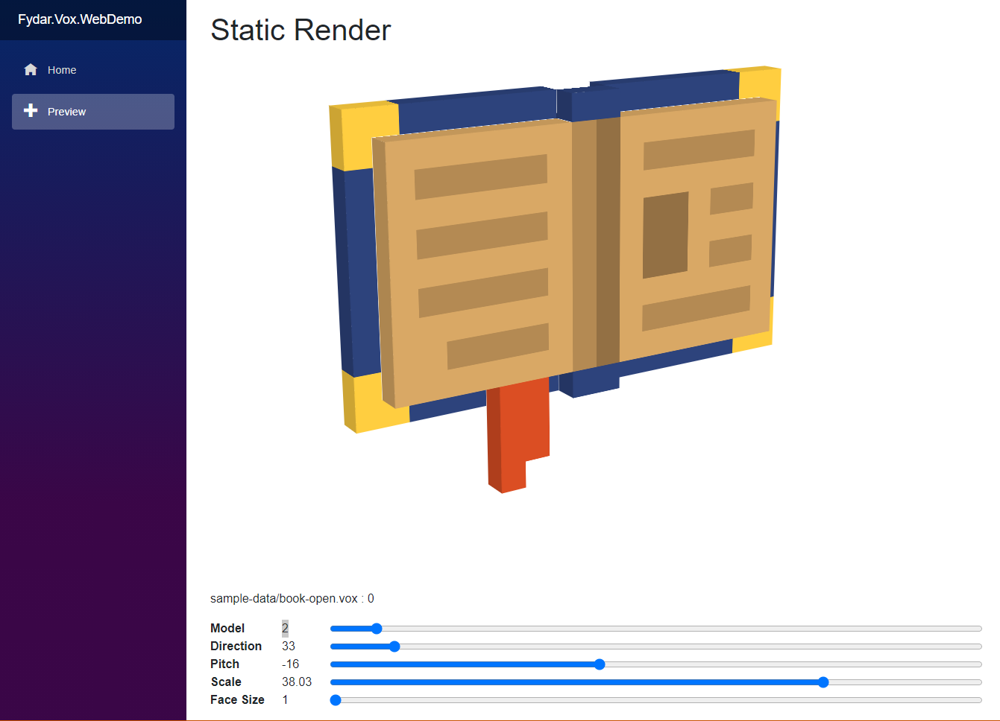

<h1>

Fydar.Vox
</h1>

**Fydar.Vox** is a collection of libraries for parsing, meshing and rendering voxel models.

  
  <i>The Blazor WebAssembly voxel renderer project.</i>

## 📦 Libraries

>  \
> _Translate voxel data into a 3d mesh._

>  \
> _Create, edit, and manipulate voxel models in scenes._

>  \
> _Load .vox files provided by [MagicaVoxel](https://ephtracy.github.io/)._
